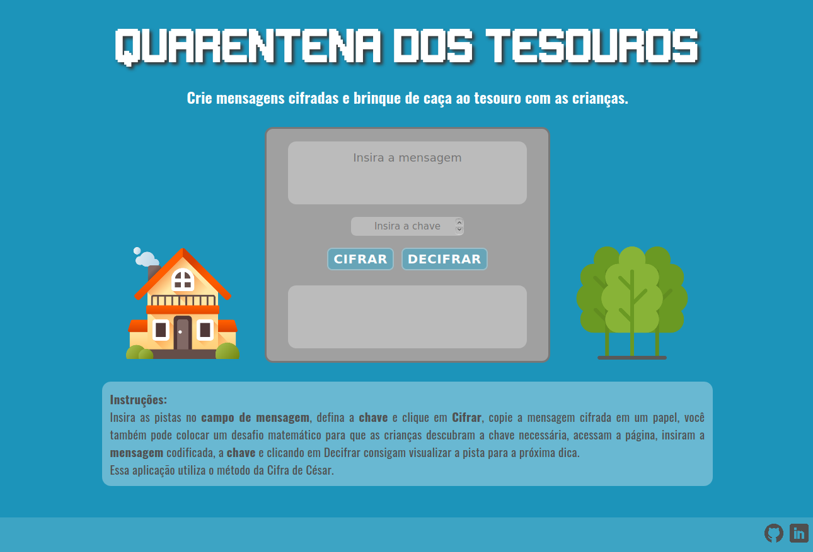

# 

#### Para acessar a página [clique aqui](https://camilagerarde.github.io/SAP004-cipher/src/). :computer:

[Introdução](#introdução) | [Como utilizar](#como-utilizar) | [Sobre a página](#sobre-a-página) | [A Cifra de César](#a-cifra-de-césar) | [Considerações gerais](#considerações-gerais) | [Considerações técnicas](#considerações-técnicas) | [Instalação e execução](#instalação-e-execução-octocat) | [Agradecimentos](#agradecimentos)

---

## Introdução

Quarentena dos Tesouros nasceu de uma necessidade de distração e atividades para pais ou responsáveis de crianças, que estão em situação de confinamento devido a pandemia do Covid-19, funciona como uma ferramenta para uma caça ao tesouro, onde as pistas são cifradas pelo método de Cifra de César, deixando a brincadeira ainda mais desafiadora.

## Como utilizar

O usuário insere a pista no **campo de mensagem**, define o número de deslocamentos, e insere no **campo da chave**, clicando em **CIFRAR** a mensagem cifrada irá aparecer na caixa de texto logo abaixo, ele então poderá copiar a pista cifrada em um papel e como sugestão pode também juntar uma questão matemática para que a criança tenha que conseguir a chave para a decifragem, a criança então acessa a página e repete os passos anteriores, inserindo a pista cifrada no campo de mensagem e a chave no campo correspondente, porém ela deverá clicar no botão **DECIFRAR** e logo abaixo vai aparecer a mensagem decifrada, seguindo assim para a próxima pista até o tesouro no final.

## Sobre a página

A página se chama **Quarentena dos Tesouros** em referência a situação de confinamento que a população brasileira e de muitos lugares no mundo vem passando e também ao objetivo da aplicação que é uma ferramenta para uma brincadeira de caça ao tesouro com as crianças.

A escolha das cores, visual, fonte e imagens fazem referência a jogos de video games :space_invader: e tem o objetivo de ser lúdico e atrativo para as crianças, sua usabilidade é simples e básica exatamente para que tantos as crianças como os adultos consigam acessar e utilizar a ferramenta sem dificuldades.



A interface permite ao usuário:

- Inserir uma mensagem (texto) para ser cifrada ou decifrada.
- Eleger uma chave (número) indicando quantas posições de deslocamento de caracteres quer que a cifra utilize.
- Ver o resultado da mensagem cifrada ou decifrada.

## A Cifra de César

Cifrar significa codificar. A [cifra de
César](https://pt.wikipedia.org/wiki/Cifra_de_C%C3%A9sar) é um dos primeiros
tipos de criptografias conhecidas na história. O imperador romano Júlio César
utilizava essa cifra para enviar ordens secretas aos seus generais no campo de
batalha.

A cifra de César é uma das técnicas mais simples de cifrar uma mensagem. É um
tipo de cifra por substituição, em que cada letra do texto original é
substituída por outra que se encontra há um número fixo de posições
(deslocamento) mais a frente do mesmo alfabeto.

Por exemplo se usarmos o deslocamento (_chave_) de 3 posições:

- Alfabeto sem cifrar: A B C D E F G H I J K L M N O P Q R S T U V W X Y Z
- Alfabeto com cifra: D E F G H I J K L M N O P Q R S T U V W X Y Z A B C
- A letra A será D
- A palavra CASA será FDVD

## Considerações gerais

- A chave de codificação deve ser um número positivo.
- O deslocamento das letras é feito apenas com letras simples (maiúsculas ou minúsculas); Símbolos, números e letras com acentuação não são deslocadas, são repetidas em suas posições.

## Considerações técnicas

**Para o desenvolvimento do projeto**

O _HTML_ foi usado para estruturação do conteúdo da página, levando em consideração a utilização de tags semânticas para acessibilidade e elementos de formulário.

O _CSS_ foi usado para estilizar a página e definir o desenho visual.

O _JavaScript_ foi usado para fazer a interação do usuário com a página utilizando elementos do DOM e fazer com que a aplicação responda (cifrar/decifrar).  
A lógica do projeto foi implementada inteiramente em _JavaScript_, usando funções e controle de fluxo.

Foi executado testes unitários para verificação da funcionalidade e o padrão foi verificado de acordo com as bibliotecas _eslint_ e _htmlhint_.  
Foi utilizado também _Git e GitHub_.

## Instalação e execução :octocat:

- Clone o projeto na sua máquina executando o seguinte comando no seu terminal:

```sh
git clone https://github.com/camilagerarde/SAP004-cipher
```

- Instale as dependências do projeto com o comando:

```sh
npm install
```

- Rode o projeto na sua máquina com:

```sh
npm start
```

- Visualize o projeto no seu navegador com o link:

```sh
http://localhost:5000
```

- Rode os testes com o comando:

```sh
npm test
```

## Agradecimentos

Ícones: [Freepik](https://www.flaticon.com/br/autores/freepik), [Monkik](https://www.flaticon.com/br/autores/monkik) e [Smashicons](https://www.flaticon.com/br/autores/smashicons).  
Fonte [Geronimo](https://www.dafont.com/pt/paradox-fontworks.d5233?)

**Feito por [Camila Cunha](https://github.com/camilagerarde) com base no projeto da [Laboratória](https://github.com/Laboratoria).**

[](https://forthebadge.com)
